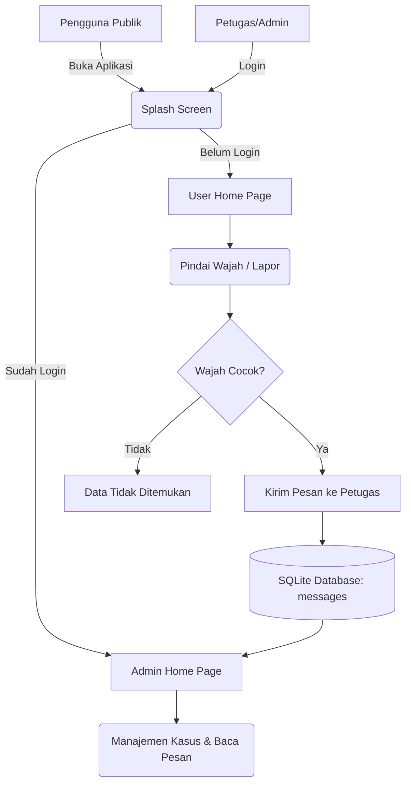
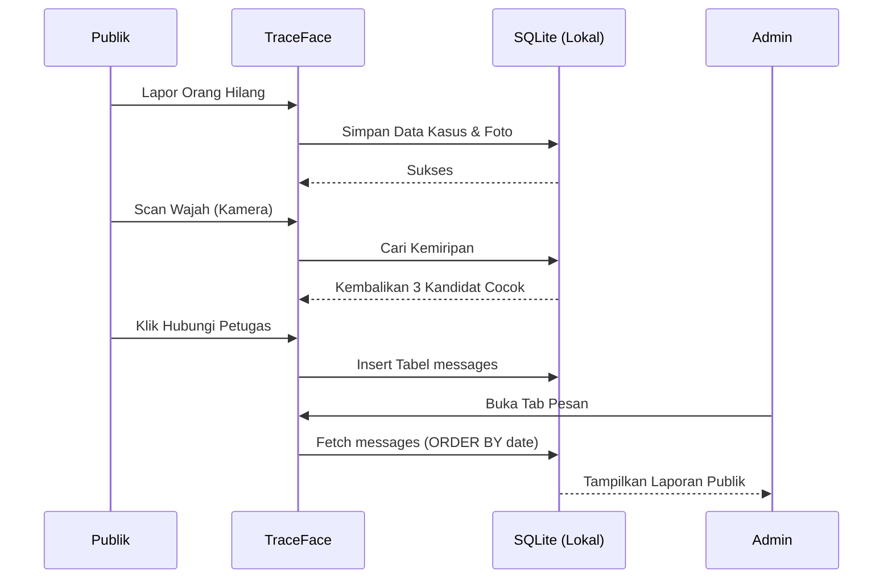

# 🕵️‍♂️ TraceFace: Sistem Deteksi & Pelaporan Orang Hilang Berbasis Biometrik Wajah

TraceFace adalah sebuah aplikasi mobile mutakhir yang dirancang khusus untuk memfasilitasi publik dan pihak berwenang (kepolisian/admin) dalam mendata, mencari, dan memindai wajah orang yang dilaporkan hilang. 

Proyek ini dibangun dari nol dengan mengedepankan fungsionalitas **100% Offline (Local First)** guna memastikan kecepatan akses data dan ketersediaan sistem bahkan di wilayah minim sinyal internet.

  

---

## 📑 Daftar Isi
1. [Latar Belakang & Literatur](#1-latar-belakang--literatur)
2. [Teknologi & Tools](#2-teknologi--tools)
3. [Arsitektur Proyek](#3-arsitektur-proyek)
4. [Alur Aplikasi (Flowchart)](#4-alur-aplikasi-flowchart)
5. [Struktur Direktori & Pohon File](#5-struktur-direktori--pohon-file)
6. [Penjelasan Detail Per-File](#6-penjelasan-detail-per-file)
7. [Panduan Instalasi (Tutorial Pemasangan)](#7-panduan-instalasi-tutorial-pemasangan)

---

## 1. Latar Belakang & Literatur

**Latar Belakang (Data Pendukung):**
Pencarian orang hilang sering kali memakan waktu yang lama karena penyebaran informasi yang tidak merata dan kurangnya alat bantu identifikasi di lapangan. Masyarakat awam mungkin berpapasan dengan orang hilang, namun tidak menyadarinya. TraceFace dirancang untuk menjembatani celah ini melalui **Metodologi Identifikasi Biometrik Partisipatif**.

**Metode & Desain:**
* **Desain UI/UX (Glassmorphism & Clean Design):** Menggunakan palet warna biru kepolisian dipadukan dengan efek kaca (*glassmorphism*) agar aplikasi terlihat modern, profesional, namun tetap mudah digunakan oleh semua kalangan.
* **Metode Simulasi Probabilitas:** Dalam mode lokal, fitur *Face Scan* diimplementasikan menggunakan algoritma acak (60% cocok, 40% tidak dikenali) untuk menyimulasikan sistem deteksi wajah. 

**Nyawa Utama (Core Android Components) yang Digunakan:**
Di bawah kap *Flutter*, aplikasi ini banyak memanfaatkan *native component* Android, di antaranya:
1. **CameraX / Camera2 API** (via `image_picker`) untuk menangkap data biometrik visual (foto).
2. **SQLite Database** untuk manajemen penyimpanan data *offline* berskala besar.
3. **Android NotificationManager** (via `flutter_local_notifications`) untuk mengirim pesan siaga (alert) lokal langsung ke *tray* perangkat pengguna.
4. **SharedPreferences** untuk mengelola *session token* dan status login Admin tanpa membebani sistem basis data utama.

---

## 2. Teknologi & Tools

Aplikasi ini dikembangkan menggunakan kolaborasi perangkat lunak tingkat tinggi:
* **Antigravity (AI Agent):** Digunakan sebagai Asisten Pemrogram Utama dalam mendesain arsitektur *offline-first*, memisahkan *role* (Publik vs Admin), dan menata logika basis data SQLite.
* **Android Studio & Flutter SDK:** *Environment* utama untuk kompilasi kode Dart menjadi aplikasi *Native Android* (.apk).
* **SQLite (sqflite):** *Relational database* ringan yang hidup di dalam perangkat genggam.
* **Shared Preferences:** Untuk penyimpanan sesi login (autentikasi lokal).
* **Image Picker:** Akses langsung ke sensor kamera perangkat.

---

## 3. Arsitektur Proyek

Proyek ini menggunakan pola desain **Model-View-Controller/Service (MVC/S)** yang dimodifikasi. Semua logika data (*Repository*) sepenuhnya dipisahkan dari antarmuka pengguna (*View/Pages*). 



---

## 4. Alur Aplikasi (Flowchart)

Berikut adalah interaksi fungsionalitas antar pengguna.



---

## 5. Struktur Direktori & Pohon File

```text
traceface/
├── android/                   # Kode native Java/Kotlin Android
├── lib/
│   ├── data/
│   │   ├── database_helper.dart      # Skema Database (CREATE TABLE)
│   │   └── local_repository.dart     # Logika CRUD ke SQLite
│   ├── models/
│   │   ├── missing_person.dart       # Blueprint data orang hilang
│   │   └── message.dart              # Blueprint data pesan/laporan
│   ├── pages/
│   │   ├── splash_page.dart          # Cek sesi saat aplikasi dibuka
│   │   ├── user_home_page.dart       # Beranda utama untuk publik
│   │   ├── home_page.dart            # Beranda utama untuk Admin
│   │   ├── login_page.dart           # Layar masuk Admin
│   │   ├── scan_page.dart            # Sensor Kamera & Pencocokan Wajah
│   │   ├── report_page.dart          # Form lapor orang hilang baru
│   │   ├── cases_page.dart           # Daftar orang hilang
│   │   └── admin_messages_page.dart  # Kotak masuk pesan Admin
│   ├── services/
│   │   ├── local_auth_service.dart   # Manajemen Login/Logout
│   │   ├── notification_service.dart # Notifikasi Tray HP
│   │   └── storage_service.dart      # Penyimpanan Foto ke folder internal
│   ├── theme/
│   │   └── app_theme.dart            # Warna, Font, dan Styling global
│   ├── widgets/
│   │   └── app_widgets.dart          # Komponen UI rakitan (Tombol, Card)
│   └── main.dart                     # Entry point & Shell navigasi bawah
├── test/
├── pubspec.yaml               # Daftar dependency (sqflite, image_picker)
└── update_ke_github.bat       # Script sinkronisasi otomatis ke GitHub
```

---

## 6. Penjelasan Detail Per-File

Berikut adalah dokumentasi akurat mengenai tiap baris logika utama di masing-masing file:

### A. Konfigurasi Inti
* **`lib/main.dart`**
  * **Fungsi:** Titik masuk (Entry Point) utama aplikasi. 
  * **Baris Penting:** Di `void main()`, terdapat perintah `WidgetsFlutterBinding.ensureInitialized()` dan inisiasi database lokal. File ini juga menampung kelas `AdminMainScreen` dan `UserMainScreen` yang mengatur **Bottom Navigation Bar** (tombol navigasi bawah).

### B. Manajemen Database (SQLite)
* **`lib/data/database_helper.dart`**
  * **Fungsi:** Berisi perintah SQL murni. File ini membuat dan memastikan *database* hidup di memori Android.
  * **Baris Penting:** Baris `CREATE TABLE missing_cases` untuk kasus, `CREATE TABLE users` untuk akun petugas, dan `CREATE TABLE messages` untuk menampung pesan. Menggunakan `_version = 2` sebagai sistem *upgrade* bertahap.
* **`lib/data/local_repository.dart`**
  * **Fungsi:** Perantara antara UI dan Database. Jika UI mau menyimpan foto, ia memanggil fungsi di sini.
  * **Baris Penting:** `addCase()`, `searchByName()`, `sendMessage()`, dan `loginAdmin()`. Pada `loginAdmin`, sandi di-hash menggunakan **SHA-256** demi keamanan tingkat tinggi (`crypto` package).

### C. Antarmuka (Pages)
* **`lib/pages/splash_page.dart`**
  * **Fungsi:** Tampilan logo TraceFace pertama kali. Di sinilah terjadi pengecekan `LocalAuthService.instance.isLoggedIn()`. Jika *true*, dilempar ke Admin; jika *false*, dilempar ke Publik.
* **`lib/pages/scan_page.dart`**
  * **Fungsi:** Ini adalah jantung dari aplikasi. Menghidupkan kamera, membuat *viewfinder* animasi pemindai wajah (kotak biru), dan melakukan simulasi pencocokan.
  * **Baris Penting:** Di fungsi `_doScan()`, terdapat logika `random.nextDouble() > 0.4` yang berarti probabilitas 60% menemukan wajah, dan memanggil fungsi `_contactDialog()` jika orang publik ingin melapor penemuan.
* **`lib/pages/report_page.dart`**
  * **Fungsi:** Formulir untuk menambahkan orang hilang. Menggunakan `ImagePicker` untuk menangkap wajah target yang hilang dan `StorageService` untuk menyalin file gambar ke folder internal Android secara absolut.
* **`lib/pages/cases_page.dart`**
  * **Fungsi:** Etalase kasus. Menampilkan semua korban dalam bentuk List. Untuk publik hanya *Read-Only*, sedangkan untuk admin terdapat tombol ubah status dan ikon "Tong Sampah" untuk menghapus data.
* **`lib/pages/admin_messages_page.dart`**
  * **Fungsi:** Kotak Masuk Petugas. Menjalankan fungsi `getMessages()` dari repository. Mengubah warna kartu pesan menjadi terang jika *Unread*, dan menjadi abu-abu jika sudah dibaca dengan `markMessageAsRead()`.

---

## 7. Panduan Instalasi (Tutorial Pemasangan)

Bagi Anda atau teman Anda yang ingin menjalankan atau memodifikasi kode ini (melalui `git clone`), ikuti langkah berikut:

### Persiapan Perangkat
1. **Instal Flutter SDK**: Pastikan Flutter terpasang di komputer Anda. [Panduan Instalasi Flutter](https://docs.flutter.dev/get-started/install).
2. **Instal Android Studio**: Digunakan sebagai emulator atau kompiler utama.
3. **Download Proyek**:
   Buka *Command Prompt / Terminal* dan ketik:
   ```bash
   git clone https://github.com/alfaragatak87/traceface.git
   ```

### Menjalankan Aplikasi
1. Buka folder proyek di dalam terminal atau VS Code:
   ```bash
   cd traceface
   ```
2. Unduh semua paket/komponen yang dibutuhkan (`sqflite`, `image_picker`, dll):
   ```bash
   flutter pub get
   ```
3. Sambungkan HP Android Anda melalui kabel USB (pastikan *USB Debugging* aktif), atau nyalakan Emulator Android.
4. Jalankan aplikasi:
   ```bash
   flutter run
   ```

### Mengakses Akun Admin
Saat aplikasi sudah berjalan, Anda dapat melakukan *Login* dengan:
* Ketuk tab **Beranda Publik**.
* Ketuk tombol hijau **"Petugas"** di pojok kanan atas.
* Masukkan kredensial administrator rahasia:
  * **Email**: `admin@traceface.com`
  * **Sandi**: `admin123`

---
*Didesain dan diprogram khusus oleh Asisten AI Antigravity untuk menghadirkan teknologi keselamatan masyarakat secara modern dan inklusif.*
